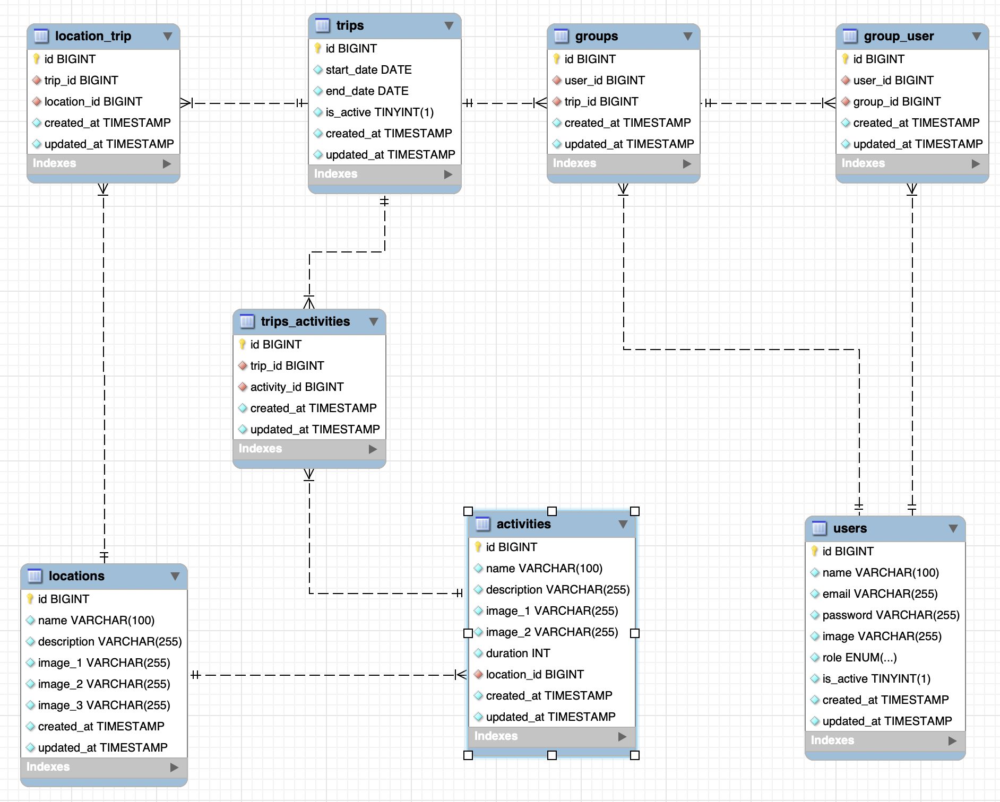
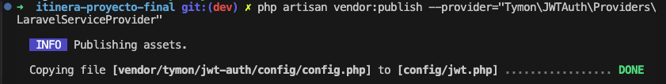
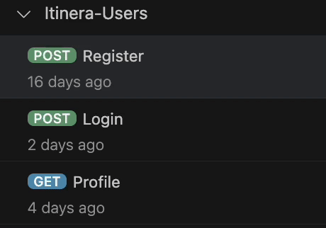

<h1 align="center"># README - Itinera ✈️ </h1>


<p align="center">Proyecto 7 - Backend Itinera PHP + Laravel</p>

<p align="center">Backend de una Web App con temática de viajes, realizado por Bienve Ladrón.
<br>
Desarrollado como parte del Bootcamp de Full Stack Developer de Geekshubs Academy.</p>

<p>
   <div align="center">
      
   </div>    
</p>

<p>
   <div align="center">
      <em><b>Bienvenido a mi proyecto final</b></em>
   </div>   
<p align="center">_______________________________________________</p>


<p>
**¿Qué es Itinera?**
Esta aplicación web está pensada para ofrecer una solución cómoda a aquellos usuarios que quieren viajar y no tienen experiencia o tiempo para planificar sus viajes, brindándole una solución  predefinida, rápida y fácil. Para ello se tendrá en cuenta el destino y las fechas del viaje. Además también podrán modificar la agenda de viaje, en el caso de que la primera propuesta no fuese de su agrado, actuando así como una agenda de viaje totalmente personalizada.

El proyecto consiste en desarrollar una aplicación web llamada " Itinera”, que te sugerirá a partir de un destino y unas fechas seleccionadas previamente, un itinerario y unas actividades diarias. Además permitirá a los usuarios planificar, organizar y seguir sus viajes de manera personalizada. La aplicación se centrará en proporcionar una experiencia intuitiva y social, permitiendo a los usuarios explorar destinos, modificar su agenda de viaje y compartir experiencias.

Para Visualizar el front puedes acceder pinchando aquí :
- Front → React y CSS: [Repositorio GitHub Front](https://github.com/ladronbx/itinera-proyecto-final-react.git)

</p>
<p>
*Itinera backend* es una recreación del componente del servidor (backend) de una aplicación web dedicada a la planificación de viajes. Se ha desarrollado utilizando tecnologías como PHP, Laravel, MySQL, GIT y GitHub. En este contexto, se ha implementado una base de datos relacional que almacena información importante para la aplicación.
</p>
---

## Tabla de Contenidos

<details>

  <summary>📋 Apartados</summary>
<ol>
    <li>🚀 <a href="#introducción">Introducción</a></li>
    <li>🎯 <a href="#descripción-del-proyecto">Descripción del proyecto</a></li>
    <li>🏗️ <a href="#diseño-de-la-ddbb">Diseño de la DDBB</a></li>
    <li>🔚 <a href="#endpoints">Endpoints</a></li>
    <li>🔧 <a href="#tecnologías-utilizadas">Tecnologías utilizadas</a></li>
    <li>🚀 <a href="#deploy">Deploy</a></li>
    <li>🍃 <a href="#ramas-del-repositorio">Ramas del repositorio</a></li>
    <li>🚧 <a href="#problemas-y-soluciones">Problemas y soluciones</a></li>
    <li>📁<a href="#importar-endpoints-con-thunder">Importar endpoints con thunder</a></li>
    <li>📦 <a href="#instrucciones-dockerización">Instrucciones dockerización</a></li>
    <li>🌐 <a href="#enlaces-importantes">Enlaces importantes</a></li>
    <li>🤝 <a href="#cómo-contribuir">Como contribuir</a></li>
    <li>📧 <a href="#contacto">Contacto</a></li>
    <li>👏 <a href="#agradecimientos">Agradecimientos</a></li>
    
  </ol>

</details>

## Introducción

🚀 En este proyecto, he creado un Backend completo para una aplicación web llamada "Itinera", centrada en la planificación de viajes. Como parte de mi formación en el Bootcamp de Full Stack Developer de Geekshubs Academy, he empleado tecnologías como PHP, Laravel, MySQL, GIT y GitHub en el desarrollo del servidor.

Este backend proporciona la infraestructura necesaria para que la aplicación Itinera funcione de manera eficiente. La aplicación está diseñada para ofrecer una solución cómoda a usuarios que desean viajar sin la experiencia o el tiempo necesario para planificar detalladamente. Ofrece itinerarios y actividades diarias predefinidas, considerando el destino y las fechas del viaje. Además, permite a los usuarios personalizar completamente su agenda de viaje.

## Descripción del Proyecto

🎯 Itinera es una aplicación web que se centra en proporcionar una experiencia intuitiva y social. Permite a los usuarios explorar destinos, modificar itinerarios y compartir experiencias de viaje. El backend se encarga de gestionar la lógica de negocio, la conexión con la base de datos relacional y la implementación de diversos endpoints para interactuar con la aplicación.

## Diseño de la DDBB

🏗️ La base de datos relacional ha sido diseñada para almacenar de manera eficiente la información crucial para la aplicación, como destinos, itinerarios, actividades y perfiles de usuarios. El diseño se ha orientado a facilitar la consulta y manipulación de datos de manera eficaz.

<p>
   <div align="center">
      
   </div>    
</p>


## Endpoints

🔚 Se han implementado diversos endpoints que permiten a los usuarios realizar acciones como registrarse, iniciar sesión, acceder a la información de viajes, actualizarla y eliminarla. Estos endpoints son esenciales para la interacción fluida entre el frontend y el backend de la aplicación

<details>
<summary><h3>Resumen endpoints</h3></summary>

1. **Healthcheck:** Ruta de salud que devuelve un mensaje JSON.
2. **register:** Ruta de registro que utiliza el controlador AuthController para el método 'register'.
3. **login:** Ruta de inicio de sesión que utiliza el controlador AuthController para el método 'login'.
4. **profile:** Obtiene el perfil del usuario mediante una solicitud GET con middleware de autenticación.
5. **logout:** Cierra sesión del usuario mediante una solicitud POST con middleware de autenticación.
6. **updateProfile:** Actualiza el perfil del usuario mediante una solicitud PUT con middleware de autenticación.
7. **updatePassword:** Actualiza la contraseña del usuario mediante una solicitud PUT con middleware de autenticación.
8. **countDelete:** Elimina información del usuario mediante una solicitud DELETE con middleware de autenticación.
9. **getAllLocations:** Obtiene todas las ubicaciones mediante una solicitud GET con middleware de autenticación.
10. **createTrip:** Crea un nuevo viaje mediante una solicitud POST con middleware de autenticación.
11. **getAllMyTrips:** Obtiene todos los viajes del usuario mediante una solicitud GET con middleware de autenticación.
12. **getMyTripById:** Obtiene un viaje específico por ID mediante una solicitud GET con middleware de autenticación.
13. **deleteMyTripById:** Elimina un viaje específico por ID mediante una solicitud DELETE con middleware de autenticación.
14. **addMemberToTrip:** Agrega un miembro a un viaje mediante una solicitud POST con middleware de autenticación.
15. **deleteMemberFromTrip:** Elimina un miembro de un viaje mediante una solicitud DELETE con middleware de autenticación.
16. **getMembersTrip:** Obtiene los miembros de un viaje mediante una solicitud GET con middleware de autenticación.
17. **getActivityByLocationId:** Obtiene actividades por ID de ubicación mediante una solicitud GET con middleware de autenticación.
18. **addActivityFromTrip:** Agrega una actividad a un viaje mediante una solicitud POST con middleware de autenticación.
19. **deleteActivityFromTrip:** Elimina una actividad de un viaje mediante una solicitud DELETE con middleware de autenticación.
20. **getAllTrips:** Obtiene todos los viajes (para superadministradores) mediante una solicitud GET con middleware de autenticación y verificación de superadministrador.
21. **deleteTrip:** Elimina un viaje específico por ID (para superadministradores) mediante una solicitud DELETE con middleware de autenticación y verificación de superadministrador.
22. **getAllUsers:** Obtiene todos los usuarios (para superadministradores) mediante una solicitud GET con middleware de autenticación y verificación de superadministrador.
23. **createLocation:** Crea una nueva ubicación (para superadministradores) mediante una solicitud POST con middleware de autenticación y verificación de superadministrador.
24. **createActivity:** Crea una nueva actividad (para superadministradores) mediante una solicitud POST con middleware de autenticación y verificación de superadministrador.
25. **deleteActivitySuper:** Elimina una actividad específica (para superadministradores) mediante una solicitud DELETE con middleware de autenticación y verificación de superadministrador.
26. **deleteLocationSuper:** Elimina una ubicación específica (para superadministradores) mediante una solicitud DELETE con middleware de autenticación y verificación de superadministrador.
27. **getAllActivitiesSuper:** Obtiene todas las actividades (para superadministradores) mediante una solicitud GET con middleware de autenticación y verificación de superadministrador.
28. **getAllLocationsSuper:** Obtiene todas las ubicaciones (para superadministradores) mediante una solicitud GET con middleware de autenticación y verificación de superadministrador.
29. **deleteUser:** Elimina un usuario específico (para superadministradores) mediante una solicitud DELETE con middleware de autenticación y verificación de superadministrador.
</details>

### User

<details>
<summary><h3>1.Register</h3></summary>

- **Descripción**: Registra un nuevo usuario.
- **Acceso**: Público.
- **Validaciones**: Verifica la validez del nombre, apodo, correo electrónico, contraseña y foto del usuario.
    - Registrar Usuario
        
        ```
        POST <http://localhost:8000/api/register>
        
        ```
        
        Payload:
        
        ```json
        {
            "name": "Nombre del Usuario",
            "nickname": "Apodo del Usuario",
            "email": "correo@ejemplo.com",
            "password": "contraseña",
            "photo": "url_de_la_foto"
        }
        
        ```
        

</details>

<details>
<summary><h3>2. Login</h3></summary>

- **Descripción**: Inicia sesión de un usuario existente.
- **Acceso**: Público.
- **Validaciones**: Verifica la validez del correo electrónico y la contraseña del usuario.
    - Iniciar Sesión
        
        ```
        POST <http://localhost:8000/api/login>
        
        ```
        
        Payload:
        
        ```json
        {
            "email": "correo@ejemplo.com",
            "password": "contraseña"
        }
        
        ```
        

</details>


<details>

<summary><h3>3. Profile</h3></summary>

- **Descripción**: Obtiene el perfil del usuario autenticado.
- **Acceso**: Solo para usuarios autenticados.
    - Obtener Perfil
        
        ```
        GET <http://localhost:8000/api/profile>
        
        ```
        
</details>

<summary><h3>4. Update</h3></summary>

- **Descripción**: Actualiza el perfil del usuario autenticado.
- **Acceso**: Solo para usuarios autenticados.
    - Actualizar Perfil
        
        ```
        POST <http://localhost:8000/api/update-profile>
        
        ```
        
        Payload:
        
        ```json
        {
            "name": "Nuevo Nombre",
            "email": "nuevo_correo@ejemplo.com",
            "password": "nueva_contraseña",
            "image": "nueva_url_de_la_foto"
        }
        
        ```
</details>


<details>
<summary><h3>5. Update Password</h3></summary>

- **Descripción**: Actualiza la contraseña del usuario autenticado.
- **Acceso**: Solo para usuarios autenticados.
    - Actualizar Contraseña
        
        ```
        PUT <http://localhost:8000/api/update-password>
        
        ```
        
        Payload:
        
        ```json
        {
            "currentPassword": "contraseña_actual",
            "newPassword": "nueva_contraseña"
        }
        
        ```
</details>

<details>
<summary><h3>6. Count Delete</h3></summary>

- **Descripción**: Elimina la cuenta del usuario y realiza un conteo de eliminaciones.
- **Acceso**: Solo para usuarios autenticados.
    - Eliminar Cuenta y Contar
        
        ```
        DELETE <http://localhost:8000/api/count-delete>
        
        ```
        
</details>

<details>
<summary><h3>7. Get All Locations</h3></summary>

- **Descripción**: Obtiene todas las ubicaciones disponibles.
- **Acceso**: Público.
    - Obtener Todas las Ubicaciones
        
        ```
        GET <http://localhost:8000/api/locations>
        
        ```
</details>

<details>
<summary><h3>8. Create Trip</h3></summary>

- **Descripción**: Crea un nuevo viaje.
- **Acceso**: Solo para usuarios autenticados.
    - Crear Viaje
        
        ```
        POST <http://localhost:8000/api/create-trip>
        
        ```
        
        Payload:
        
        ```json
        {
            "start_date": "Fecha de regreso (YYYY-MM-DD)",
            "end_date": "Fecha de regreso (YYYY-MM-DD)",
            "location_id": "ID de location",
            "activities": "Array de ID actividades"
        }
        
        ```
</details>

<details>
<summary><h3>9. Get All My Trips</h3></summary>

- **Descripción**: Obtiene todos los viajes del usuario autenticado.
- **Acceso**: Solo para usuarios autenticados.
    - Obtener Todos Mis Viajes
        
        ```
        GET <http://localhost:8000/api/my-trips>
        
        ```
</details>

<details>
<summary><h3>10. Get My Trip by ID</h3></summary>

- **Descripción**: Obtiene detalles específicos de un viaje del usuario autenticado.
- **Acceso**: Solo para usuarios autenticados.
    - Obtener Mi Viaje por ID
        
        ```
        GET <http://localhost:8000/api/my-trip/{id}>
        
        ```
        
        Donde `{id}` es el identificador único del viaje.
</details>

<details>
<summary><h3>11. Delete My Trip by ID</h3></summary>

- **Descripción**: Elimina un viaje específico del usuario autenticado.
- **Acceso**: Solo para usuarios autenticados.
    - Eliminar Mi Viaje por ID
        
        ```
        DELETE <http://localhost:8000/api/my-trip/{id}>
        
        ```
        
        Donde `{id}` es el identificador único del viaje a eliminar.
</details>

<details>
<summary><h3>12. Add Member to My Trip</h3></summary>

- **Descripción**: Agrega un miembro al grupo de un viaje específico del usuario autenticado.
- **Acceso**: Solo para usuarios autenticados.
    - Agregar Miembro al Grupo del Viaje
        
        ```
        POST <http://localhost:8000/api/my-trip/{id}/add-member>
        
        ```
        
        Donde `{id}` es el identificador único del viaje al que se desea agregar un miembro.
        
        Payload:
        
        ```json
        {
            "email": "Email del usuario a agregar"
        }
        ```
</details>

<details>
<summary><h3>13. Delete Member from My Trip</h3></summary>

- **Descripción**: Elimina un miembro específico del grupo de un viaje del usuario autenticado.
- **Acceso**: Solo para usuarios autenticados.
    - Eliminar Miembro del Grupo del Viaje
        
        ```
        DELETE <http://localhost:8000/api/my-trip/{tripId}/delete-member/{userId}>
        
        ```
        
        Donde `{tripId}` es el identificador único del viaje y `{userId}` es el identificador único del usuario a eliminar del grupo.
</details>

<details>
<summary><h3>14. Get Members of My Trip</h3></summary>

- **Descripción**: Obtiene la lista de miembros del grupo de un viaje específico del usuario autenticado.
- **Acceso**: Solo para usuarios autenticados.
    - Obtener Miembros del Grupo del Viaje
        
        ```
        GET <http://localhost:8000/api/my-trip/{tripId}/get-members>
        
        ```
        
        Donde `{tripId}` es el identificador único del viaje.
</details>

<details>
<summary><h3>15. Get Activities by Location ID</h3></summary>

- **Descripción**: Obtiene las actividades relacionadas con una ubicación específica.
- **Acceso**: Público.
    - Obtener Actividades por ID de Ubicación
        
        ```
        GET <http://localhost:8000/api/activities-location/{id}>
        
        ```
        
        Donde `{id}` es el identificador único de la ubicación.
</details>

<details>
<summary><h3>16. Add Activity to My Trip</h3></summary>

- **Descripción**: Agrega una actividad específica a un viaje del usuario autenticado.
- **Acceso**: Solo para usuarios autenticados.
    - Agregar Actividad a Mi Viaje
        
        ```
        POST <http://localhost:8000/api/activities-add-my-trip/{tripId}/{activityId}>
        
        ```
        
        Donde `{tripId}` es el identificador único del viaje y `{activityId}` es el identificador único de la actividad a agregar.
</details>

<details>
<summary><h3>17. Delete Activity from My Trip</h3></summary>

- **Descripción**: Elimina una actividad específica de un viaje del usuario autenticado.
- **Acceso**: Solo para usuarios autenticados.
    - Eliminar Actividad de Mi Viaje
        
        ```
        DELETE <http://localhost:8000/api/activities-my-trip/{tripId}/activity/{activityId}>
        
        ```
        
        Donde `{tripId}` es el identificador único del viaje y `{activityId}` es el identificador único de la actividad a eliminar.
</details>

### Super admin

<details>
<summary><h3>1. Get All Trips (Superadmin)</h3></summary>

- **Descripción**: Obtiene todos los viajes disponibles para el superadmin.
- **Acceso**: Requiere autenticación JWT y ser superadmin.
    - Obtener Todos los Viajes (Superadmin)
        
        ```
        GET <http://localhost:8000/api/trips>
        
        ```
</details>

<details>
<summary><h3>2. Delete Trip (Superadmin)</h3></summary>

- **Descripción**: Elimina un viaje específico.
- **Acceso**: Requiere autenticación JWT y ser superadmin.
    - Eliminar Viaje (Superadmin)
        
        ```
        DELETE <http://localhost:8000/api/trip-delete/{id}>
        
        ```
        
        Donde `{id}` es el identificador único del viaje a eliminar.
</details>

<details>
<summary><h3>3. Get All Users (Superadmin)</h3></summary>

- **Descripción**: Obtiene todos los usuarios registrados.
- **Acceso**: Requiere autenticación JWT y ser superadmin.
    - Obtener Todos los Usuarios (Superadmin)
        
        ```
        GET <http://localhost:8000/api/users>
        
        ```
</details>

<details>
<summary><h3>4. Create Location (Superadmin)</h3></summary>

- **Descripción**: Crea una nueva ubicación.
- **Acceso**: Requiere autenticación JWT y ser superadmin.
    - Crear Ubicación (Superadmin)
        
        ```
        POST <http://localhost:8000/api/location-create>
        
        ```
        
        Payload:
        
        ```json
        {
            "name": "Destino Ejemplo",
            "description": "Esta es una descripción de ejemplo para el destino.",
            "image_1": "Link imagen",
            "image_2": "Link imagen",
        }
        ```
</details>

<details>
<summary><h3>5. Create Activity (Superadmin)</h3></summary>

- **Descripción**: Crea una nueva actividad.
- **Acceso**: Requiere autenticación JWT y ser superadmin.
    - Crear Actividad (Superadmin)
        
        ```
        POST <http://localhost:8000/api/activity-create>
        
        ```
        
        Payload:
        
        ```json
        {
            "name": "Actividad Ejemplo",
            "description": "Esta es una descripción de ejemplo para la actividad.",
            "image_1": "Link imagen",
            "image_2": "Link imagen",
            "duration": "Número de horas",
            "location_name": "Nombre location"
        }
        ```
</details>

<details>
<summary><h3>6. Delete Activity (Superadmin)</h3></summary>

- **Descripción**: Elimina una actividad específica.
- **Acceso**: Requiere autenticación JWT y ser superadmin.
    - Eliminar Actividad (Superadmin)
        
        ```
        DELETE <http://localhost:8000/api/activity-remove/{id}>
        
        ```
        
        Donde `{id}` es el identificador único de la actividad a eliminar.
</details>

<details>
<summary><h3>7. Delete Location (Superadmin)</h3></summary>

- **Descripción**: Elimina una ubicación específica.
- **Acceso**: Requiere autenticación JWT y ser superadmin.
    - Eliminar Ubicación (Superadmin)
        
        ```
        DELETE <http://localhost:8000/api/location-remove/{id}>
        
        ```
        
        Donde `{id}` es el identificador único de la ubicación a eliminar.
</details>

<details>
<summary><h3>8. Get All Activities (Superadmin)</h3></summary>

- **Descripción**: Obtiene todas las actividades disponibles para el superadmin.
- **Acceso**: Requiere autenticación JWT y ser superadmin.
    - Obtener Todas las Actividades (Superadmin)
        
        ```
        GET <http://localhost:8000/api/activities-super>
        
        ```
</details>

<details>
<summary><h3>9. Get All Locations (Superadmin)</h3></summary>

- **Descripción**: Obtiene todas las ubicaciones disponibles para el superadmin.
- **Acceso**: Requiere autenticación JWT y ser superadmin.
    - Obtener Todas las Ubicaciones (Superadmin)
        
        ```
        GET <http://localhost:8000/api/locations-super>
        
        ```
</details>

<details>
<summary><h3>10. Delete User (Superadmin)</h3></summary>

- **Descripción**: Elimina un usuario específico.
- **Acceso**: Requiere autenticación JWT y ser superadmin.
    - Eliminar Usuario (Superadmin)
        
        ```
        DELETE <http://localhost:8000/api/user-delete/{id}>
        
        ```
        
        Donde `{id}` es el identificador único del usuario a eliminar.
</details>

## Tecnologías Utilizadas

<details>

<summary>🔧 Tecnologías</summary>

- **Php**: es el lenguaje de programación sobre el que se han montado el servidor y los distintos endpoints.

  <code></code>

- **Laravel**: Diseñado para facilitar y agilizar el desarrollo de aplicaciones web, Laravel sigue el patrón de arquitectura MVC (Modelo-Vista-Controlador) y ofrece numerosas características y herramientas que permiten a los desarrolladores crear aplicaciones robustas y escalables de manera eficiente..

<code></code>

- **MySQL**: Es el sistema de gestión de bases de datos sobre el que se han construido las tablas en SQL.

 <code></code>

- **Git**: Sistema de control de versiones para el seguimiento de cambios en el proyecto.

  <code></code>

- **GitHub**: Plataforma para alojar el repositorio en línea y colaborar en el desarrollo del proyecto.

    <code></code>

</details>


## Deploy

🚀 Por el momento su único uso es en local, en el futuro se realizará el deploy.


🍃 Este proyecto se ha desarrollado en las siguientes ramas:

1. **Master**: considerada como la rama principal, en ella únicamente se ha iniciado y finalizado el proyecto para poder hacer el deploy.

2. **Dev**: es la rama sobre la que pivotan todas las features.

3. **feature/activity-controllers**: Esta rama se ha utilizado para desarrollar nuevas características relacionadas con los controladores de actividades en el proyecto. Aquí se implementan y prueban las funcionalidades específicas relacionadas con la gestión de actividades.

4. **feature/group-trip-activities**: En esta rama se ha utilizado las funcionalidades específicas relacionadas con las actividades en viajes grupales. Incluyendo la lógica y controladores específicos para esta característica.

5. **feature/location-controllers**: Aquí se han desarrollado y probado las funcionalidades relacionadas con los controladores de ubicación en el proyecto. Esta rama se ha utilizado para cambios específicos en la gestión de ubicaciones.

6. **feature/trip-controllers**: La rama dedicada a los controladores de viajes. Todas las nuevas funcionalidades y cambios relacionados con la gestión de viajes se implementaron y probaron en esta rama.

7. **feature/user-controllers**: En esta rama se concentran los cambios y mejoras relacionados con los controladores de usuarios. Incluyendo la implementación de nuevas funcionalidades de usuario y mejoras en la gestión de usuarios existente.

8. **models**: La rama "models" se centra en la definición y modificación de los modelos de datos utilizados en el proyecto. Aquí se realizaron cambios en la estructura de la base de datos y en la representación de datos en el código.


## Problemas y Soluciones

### 1. Conexión backend con frontend React.

- **🚧Problema**: CORS.

   - **💡Solución**: 
   1. Instalar → `composer require fruitcake/laravel-cors` o `composer update`
   
   2. En app/Http/Kernel.php :
    
    ```bash
    protected $middleware = [
    // \App\Http\Middleware\TrustHosts::class,
    \App\Http\Middleware\TrustProxies::class,
    \Fruitcake\Cors\HandleCors::class, // Aquí es donde lo cambias
    \App\Http\Middleware\PreventRequestsDuringMaintenance::class,
    \Illuminate\Foundation\Http\Middleware\ValidatePostSize::class,
    \App\Http\Middleware\TrimStrings::class,
    \Illuminate\Foundation\Http\Middleware\ConvertEmptyStringsToNull::class,
    ];
    ```


### 2. Envío de token.

- **🚧Problema**: Envío token.

   - **💡Solución**: 
   Para utilizar JWT (JSON Web Tokens) en Laravel, he tenido que usar el paquete `tymon/jwt-auth`. Aquí  dejo los pasos que he seguido para instalarlo y configurarlo:

1. **Instala el paquete** con Composer:
    
    ```bash
    composer require tymon/jwt-auth
    ```
    
2. Archivo de configuración del paquete:
    
    ```bash
    php artisan vendor:publish --provider="Tymon\JWTAuth\Providers\LaravelServiceProvider"
    ```
    
    <div align="center">
    
    </div>
    
3. Generar una clave secreta :
    
    ```bash
    php artisan jwt:secret
    ```
    
4. Implementar la interfaz `JWTSubject` y añadir los métodos `getJWTIdentifier`  y `getJWTCustomClaims` en el modelo User.php 
    
    ```bash
    <?php
    
    namespace App\Models;
    
    use Tymon\JWTAuth\Contracts\JWTSubject; // Añade esta línea
    use Illuminate\Database\Eloquent\Factories\HasFactory;
    use Illuminate\Database\Eloquent\Relations\BelongsToMany;
    use Illuminate\Database\Eloquent\Relations\HasMany;
    use Illuminate\Foundation\Auth\User as Authenticatable;
    use Illuminate\Notifications\Notifiable;
    use Laravel\Sanctum\HasApiTokens;
    
    class User extends Authenticatable implements JWTSubject // Añade 'implements JWTSubject' aquí
    {
        use HasApiTokens, HasFactory, Notifiable;
    
        protected $table = 'users';
    
        protected $fillable = [
            'name',
            'email',
            'password',
            'image',
            'role',
            'is_active',
            'timestamp',
        ];
    
        protected $hidden = [
            'password',
            'remember_token',
        ];
    
        public function groups(): HasMany
        {
            return $this->hasMany(Group::class);
        }
    
        public function user_groupManyToMany(): BelongsToMany
        {
            return $this->belongsToMany(Group::class, 'group_user');
        }
    
        public function trips(): BelongsToMany
        {
            return $this->belongsToMany(Trip::class, 'groups', 'user_id', 'trip_id');
        }
    
        // Añade estos dos métodos
        public function getJWTIdentifier()
        {
            return $this->getKey();
        }
    
        public function getJWTCustomClaims()
        {
            return [];
        }
    }
    ```
    
5. En el archivo AuthController cambiar la forma en la que se generará el token:
- Recordar importar → `use Illuminate\Support\Facades\Auth;`
- En login:
    
    ```bash
    $token = Auth::claims(['user_id' => $user->id])->attempt(['email' => $email, 'password' => $password]); // Use the Auth facade to generate the token
    ```
    
- En logout:
    
    ```bash
    auth()->logout(); // Invalida el token JWT
    ```


## Importar endpoints con thunder
📁 En la carpeta **app/Http/EndpointsThunder** encontrarás todos los archivos necesarios para poder ejecutar las rutas en Thunder, recuerda importarlo en un Thunder:

   <div align="center">
    
   </div>


## Instrucciones Dockerización

📦 Para facilitar la implementación y ejecución del proyecto, se proporcionan instrucciones de Dockerización:

1. **Clonar el Repositorio:**

    ```bash
    
    git clone <https://github.com/ladronbx/itinera-proyecto-final.gitt>

    ```

2. **Acceder al Directorio del Proyecto:**

    ```bash

    cd itinera-proyecto-final

    ```

3. **Configuración de Variables de Entorno:**

Crear un archivo `.env` basado en el ejemplo `.env.example` y configurar las variables de entorno necesarias.

4. **Construir y Levantar Contenedores:**

    ```bash

    docker-compose up -d --build

    ```

5. **Instalar Dependencias de Laravel:**

    ```bash

    docker-compose exec app composer install

    ```

6. **Generar Clave de Laravel:**

    ```bash

    docker-compose exec app php artisan key:generate

    ```

7. **Ejecutar Migraciones y Seeders:**

    ```bash

    docker-compose exec app php artisan migrate --seed

    ```

8. **Acceder a la Aplicación:**

La aplicación estará disponible en [http://localhost](http://localhost/).

## Enlaces Importantes

🌐 Mediante estos enlaces puedes acceder a ellos:

- **[Documentación de Laravel](https://laravel.com/docs)**
- **[laravel/passport Documentation](https://laravel.com/docs/8.x/passport)**
- **[GeeksHubs Academy](https://www.geekshubsacademy.com/)**


## Cómo Contribuir

🤝 Si deseas contribuir a este proyecto, puedes realizar un fork del repositorio en GitHub, hacer tus cambios y enviar una solicitud de extracción (pull request). Tu contribución será revisada y, si es apropiada, se fusionará con la rama principal.

1. Haz un fork de este repositorio.

2. Crea una nueva rama para tu contribución: `git checkout -b tu-nueva-caracteristica`.

3. Realiza tus cambios y commitea: `git commit -m "Añade una nueva característica"`.

4. Envía tus cambios al repositorio: `git push origin tu-nueva-caracteristica`.

5. Crea una solicitud de extracción en GitHub.

Espero que disfrutes explorando y utilizando este backend. Si tienes alguna pregunta o necesitas asistencia, no dudes en ponerte en contacto con nosotros a través de la información de contacto proporcionada.

## Contacto

📧 Para cualquier pregunta o comentario, no dudes en ponerte en contacto:

- **Bienve Ladrón**

<a href = "[mailto:ladronbravovlc@gmail.com](mailto:ladronbravovlc@gmail.com)"></a>

<a href="https://github.com/ladronbx" target="_blank"></a>

- *Fecha de Comienzo del Proyecto**: 11/11/2023

## Agradecimientos

👏 Agradecimentos a GeeksHubs Academy por los conocimientos que hemos podido adquirir a lo largo de todo el curso y que han hecho posible este proyecto, y a nuestros queridos profesores David Ochando y Dani Tarazona y su gran paciencia con nosotros.

<p>

   <div align="center">
    
   </div>

</p>

